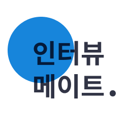
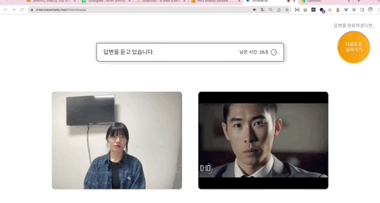
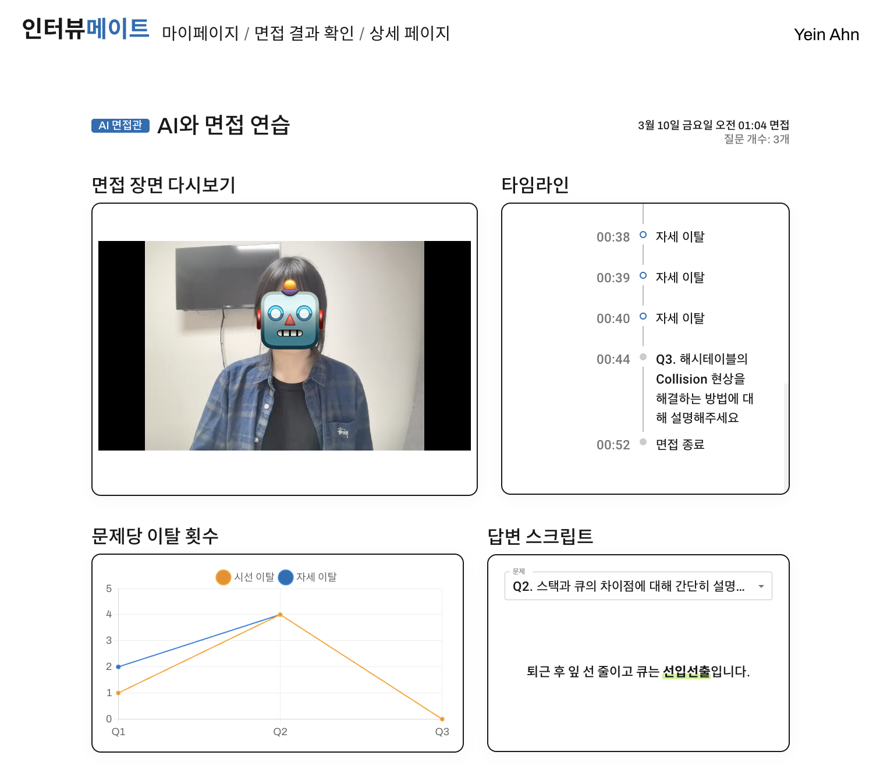
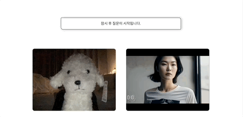
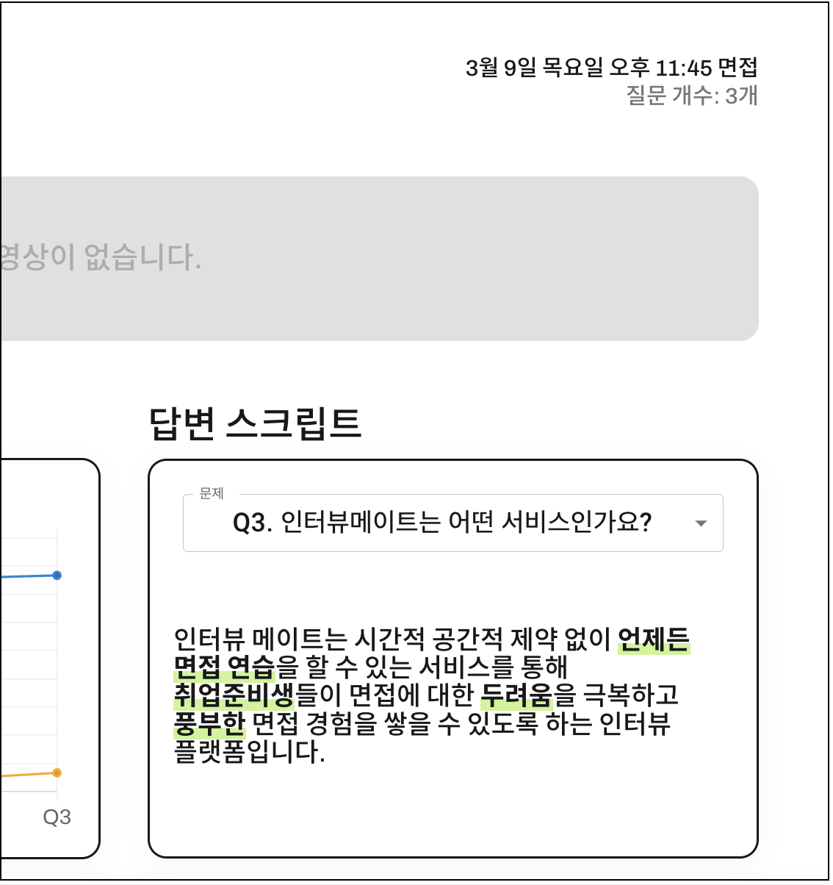
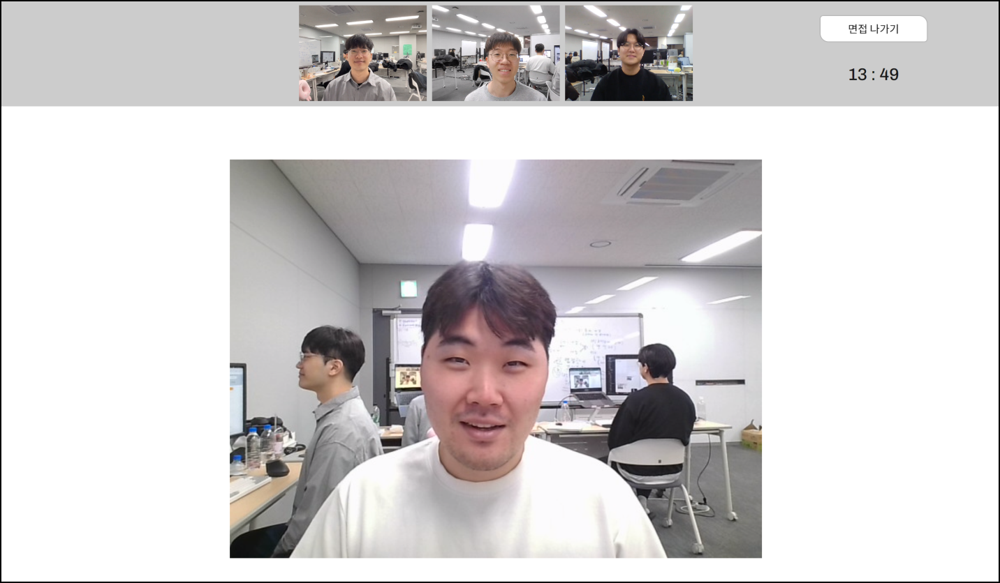
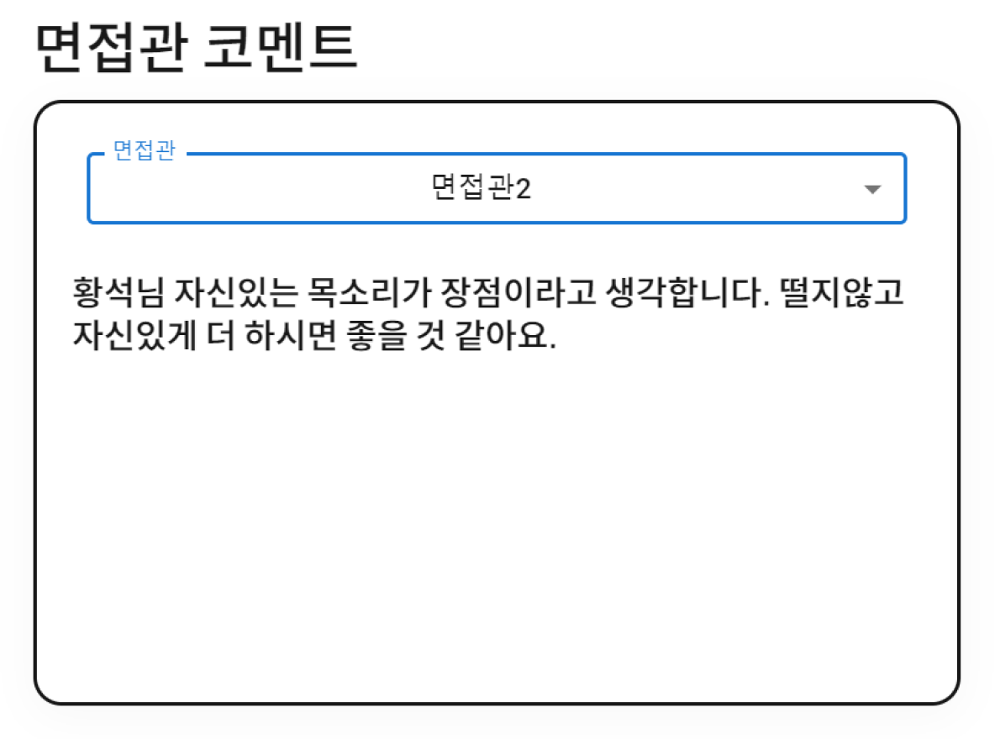
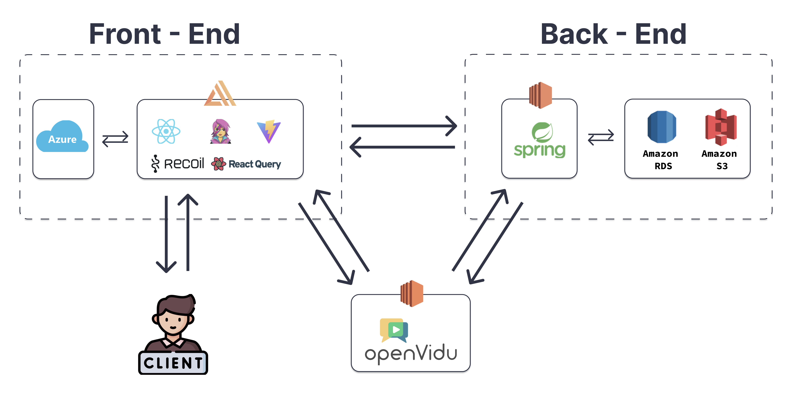
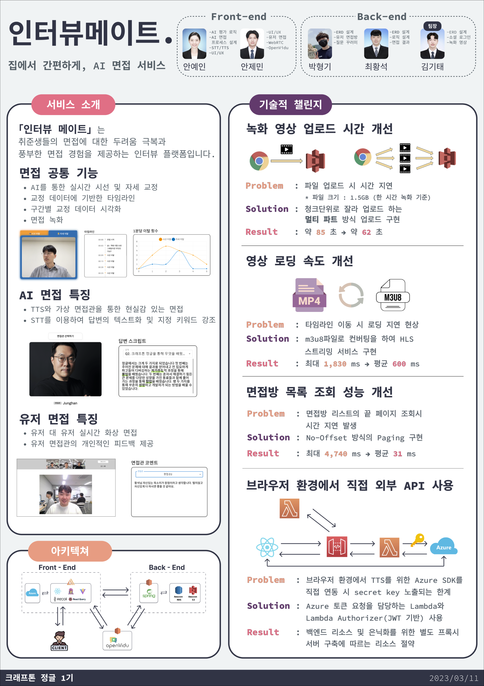

# 인터뷰메이트.

  
   
  집에서 간편하게, AI 면접 서비스

## 개요

「인터뷰 메이트」는 시간적, 공간적 제한없이 언제든 면접을 연습할 수 있는 서비스를 통해 취업준비생들의 면접에 대한 두려움 극복과 풍부한 면접 경험을 제공하는 인터뷰 플랫폼입니다.

(프로젝트 기간: 2023년 2월 3일 - 2023년 3월 11일)

## 서비스 소개

인터뷰 메이트의 기능은 크게 두 가지 입니다. :

1. AI와 함께하는 면접 🤖
2. 사람과 함께하는 면접 🧑🏻‍💻

### 주요 기능

#### 면접 공통 기능

- AI를 통한 시선/자세에 대한 실시간 피드백

  
   

    - Tensorflow.js의 face landmark detection을 활용하여 시선 및 자세 이탈을 감지

- 면접 과정에 대한 데이터를 시각적으로 파악할 수 있는 면접 결과 확인 기능

  
   

    - 면접 영상 다시보기 기능

    - 구간별 이탈 횟수를 확인할 수 있는 차트

    - 시선/자세 이탈 시점을 기록한 타임라인

#### AI 면접

- TTS(Text-to-Speech)로 질문을 읽어주는 가상 면접관

  
   

    - Azure의 Speech Service를 사용하여 실시간으로 랜덤한 질문을 읽어주는 기능

- STT(Speech-to-Text)를 활용한 사용자의 답변 스크립트화

  
   

    - [Web Speech API](https://developer.mozilla.org/en-US/docs/Web/API/Web_Speech_API) 사용

    - 스크립트 내용 중 주요 키워드 하이라이트

#### 유저 면접

- 유저 대 유저 실시간 화상 면접

  
   

    - [OpenVidu](https://openvidu.io/)를 사용하여 구현

- 면접에 대한 유저 면접관의 피드백 제공

  
   

    - 익명으로 남겨지는 다양한 피드백

## 아키텍쳐

## 프로젝트 소개 영상 (유튜브)

## 프로젝트 포스터

## 프로젝트 진행 과정

👉 [Wiki 바로가기](https://github.com/krafton-jungle-AI-InterviewMate/AI-InterviewMate-FE/wiki)
